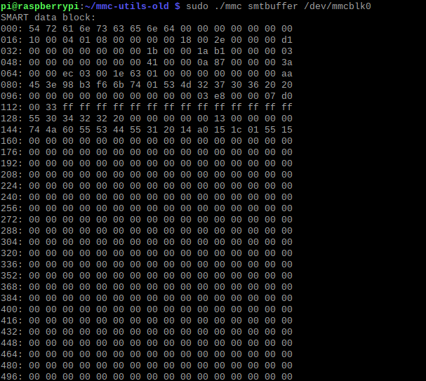
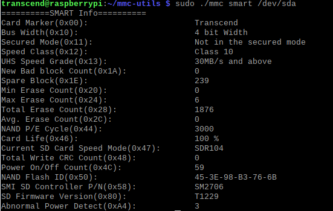
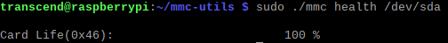
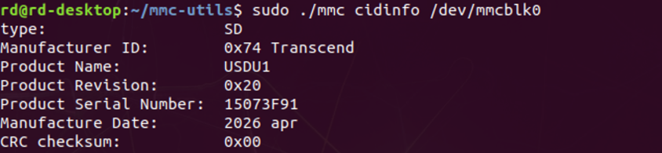
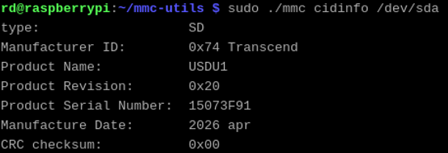
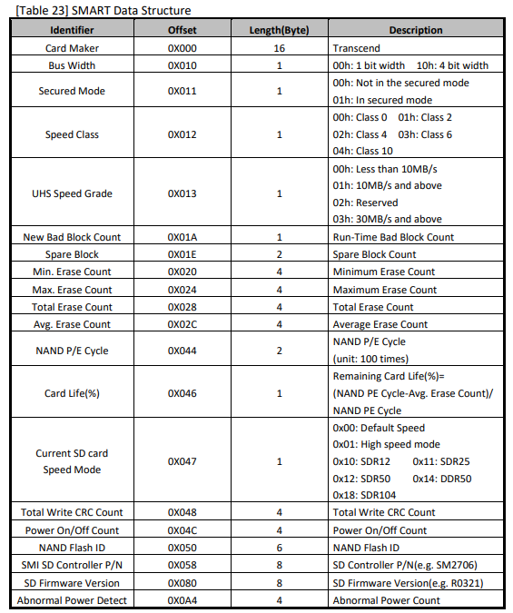
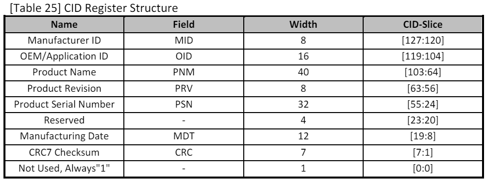

# Monitor SD card health and status using Raspberry Pi / NVIDIA Jetson Nano
Get S.M.A.R.T / CID data for Transcend Embedded microSD / SD products. 

-------------------------
The various statuses of microSD products are located in the SMART block of the device. 
By reading and analyzing the SMART block, you can get the product name, serial number, firmware version, Erase count, health, etc. of the device, so as to monitor and find the 
device early potential problems. This document provides a way to use the MMC test tools called mmc-utils that get SMART block to enable SMART command via the native microSD slot or Transcend RDF5 Card Reader on Raspberry Pi / NVIDIA Jetson Nano. 

**Note : The project works for Transcend Embedded microSD / SD products.**

Hardware requirements
-------------------------
1. Supported Platforms
   - Raspberry Pi 1 or later model
   - NVIDIA Jetson Nano

2. Supported SD cards
   - Transcend Embedded microSD 240I / 430T / 460I / 460T / 465T 
   - Transcend Embedded SD SDC460T / SDC400I / SDC240I

3. Supported Card Reader
   - Transcend RDF5

Install Raspberry Pi OS
-------------------------
1. Download and install Raspberry Pi OS Imager(64-bit or 32-bit) to the tartget microSD with an SD card reader at https://www.raspberrypi.com/software

2. Insert the microSD to Raspberry Pi native microSD or SD slot.

Install NVIDIA Jetson nano OS
-------------------------
1. Download Jetson Nano Developer Kit SD Card Image from https://developer.nvidia.com/embedded/learn/get-started-jetson-nano-devkit#write

2. Write the SD card image into the target microSD using a graphical program like Etcher.

3. Insert the microSD to NVIDIA Jetson native microSD slot.


Usage with native microSD or SD slot.
-------------------------

- The mmc-utils package and modify it to support SMART DUMP and Secure Erase function. Please download the source code and modify it step by step.

1. Download the code by following command with terminal.
   
```
 git clone https://kernel.googlesource.com/pub/scm/utils/mmc/mmc-utils
```

2. Update the 5 files in mmc-utils [folder](https://github.com/transcend-information/RaspberryPi-SDcard-SMARTQuery/tree/main/mmc-utils) to the corresponding files.

3. Use the Make command to compile the updated source code.

```
 make
```
>  **Tip:** If you encounter the error `/bin/sh: 1: sparse: not found` during the compilation process, it means that the `sparse` tool is not installed. You can install it using the following command:
>  ```
>   sudo apt-get install sparse
>  ```
>  After the installation is complete, run the `make` command again to continue the compilation process.

4. After build success, check the availability of the mmc tool by -h

```
 sudo ./mmc –h
``` 
5. Get SMART buffer by following command.

```
 sudo ./mmc smtbuffer /dev/mmcblk0
```
 
6. Get SMART information by following command.

```
 sudo ./mmc smart /dev/mmcblk0
```

7. Get Card life by following command.
   
```
 sudo ./mmc health /dev/mmcblk0
```
 
8. Get CID information by following command.
   
```
 sudo ./mmc cidinfo /dev/mmcblk0
```
9. Secure erase SD card by following command.
   
```
 sudo ./mmc sderase /dev/mmcblk0
```
Usage with the RDF5 Card Reader
-------------------------
Please change the < device > parameter by the USB card reader device. ex. /dev/sda

Command Execution
-------------------------
1. To dump SMART raw data</br></br>



3. To show SMART info</br></br>



4. To show card life(Heath)</br></br>



5. To show CID info</br></br>



Note: For other SMART / CID Data Structure, please refer to Transcend Embedded microSD / SD datasheet.</br>


